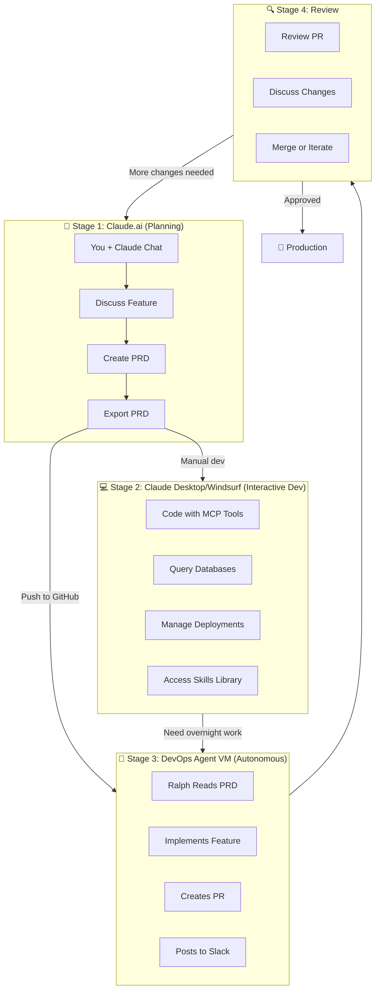
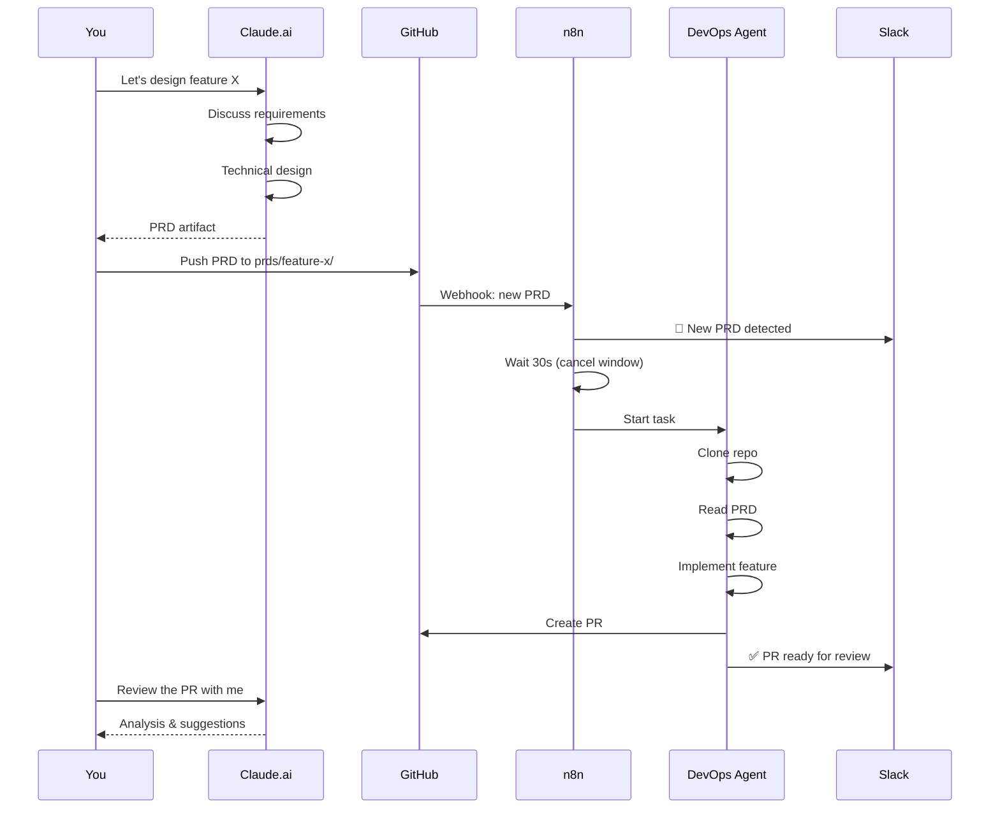
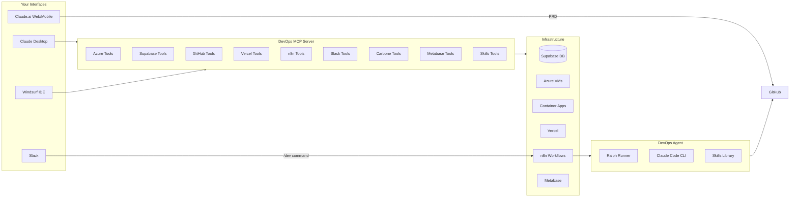
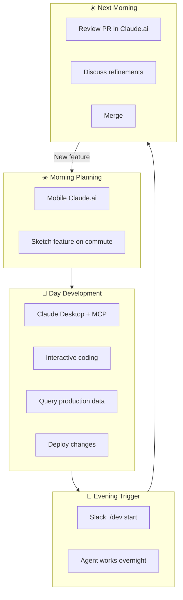
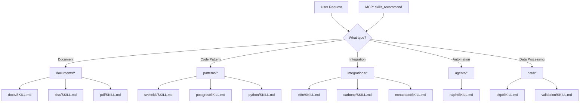
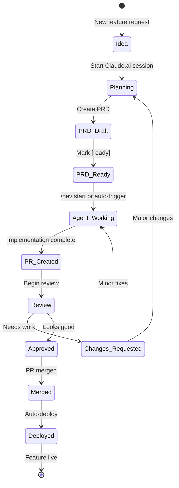

# DevOps Workflow Diagrams

## Complete Flow

```mermaid
flowchart TB
    subgraph Stage1["📱 Stage 1: Claude.ai (Planning)"]
        A[You + Claude Chat] --> B[Discuss Feature]
        B --> C[Create PRD]
        C --> D[Export PRD]
    end
    
    subgraph Stage2["💻 Stage 2: Claude Desktop/Windsurf (Interactive Dev)"]
        E[Code with MCP Tools]
        F[Query Databases]
        G[Manage Deployments]
        H[Access Skills Library]
    end
    
    subgraph Stage3["🤖 Stage 3: DevOps Agent VM (Autonomous)"]
        I[Ralph Reads PRD]
        J[Implements Feature]
        K[Creates PR]
        L[Posts to Slack]
    end
    
    subgraph Stage4["🔍 Stage 4: Review"]
        M[Review PR]
        N[Discuss Changes]
        O[Merge or Iterate]
    end
    
    D -->|Push to GitHub| Stage3
    D -->|Manual dev| Stage2
    Stage2 -->|Need overnight work| Stage3
    Stage3 --> Stage4
    Stage4 -->|More changes needed| Stage1
    Stage4 -->|Approved| P[🚀 Production]
```

## PRD Flow

```mermaid
sequenceDiagram
    participant You
    participant Claude.ai
    participant GitHub
    participant n8n
    participant Agent as DevOps Agent
    participant Slack
    
    You->>Claude.ai: Let's design feature X
    Claude.ai->>Claude.ai: Discuss requirements
    Claude.ai->>Claude.ai: Technical design
    Claude.ai-->>You: PRD artifact
    
    You->>GitHub: Push PRD to prds/feature-x/
    GitHub->>n8n: Webhook: new PRD
    n8n->>Slack: 🔔 New PRD detected
    n8n->>n8n: Wait 30s (cancel window)
    n8n->>Agent: Start task
    
    Agent->>Agent: Clone repo
    Agent->>Agent: Read PRD
    Agent->>Agent: Implement feature
    Agent->>GitHub: Create PR
    Agent->>Slack: ✅ PR ready for review
    
    You->>Claude.ai: Review the PR with me
    Claude.ai-->>You: Analysis & suggestions
```

## Tool Ecosystem

```mermaid
graph LR
    subgraph Interfaces["Your Interfaces"]
        A[Claude.ai Web/Mobile]
        B[Claude Desktop]
        C[Windsurf IDE]
        D[Slack]
    end
    
    subgraph MCP["DevOps MCP Server"]
        E[Azure Tools]
        F[Supabase Tools]
        G[GitHub Tools]
        H[Vercel Tools]
        I[n8n Tools]
        J[Slack Tools]
        K[Carbone Tools]
        L[Metabase Tools]
        M[Skills Tools]
    end
    
    subgraph Infrastructure["Infrastructure"]
        N[(Supabase DB)]
        O[Azure VMs]
        P[Container Apps]
        Q[Vercel]
        R[n8n Workflows]
        S[Metabase]
    end
    
    subgraph Agent["DevOps Agent"]
        T[Ralph Runner]
        U[Claude Code CLI]
        V[Skills Library]
    end
    
    B --> MCP
    C --> MCP
    MCP --> Infrastructure
    
    A -->|PRD| GitHub
    D -->|/dev command| R
    R --> Agent
    Agent --> GitHub
```

## Multi-Interface Usage

```mermaid
graph TB
    subgraph Morning["☀️ Morning Planning"]
        A1[Mobile Claude.ai]
        A2[Sketch feature on commute]
    end
    
    subgraph Day["🏢 Day Development"]
        B1[Claude Desktop + MCP]
        B2[Interactive coding]
        B3[Query production data]
        B4[Deploy changes]
    end
    
    subgraph Evening["🌙 Evening Trigger"]
        C1[Slack: /dev start]
        C2[Agent works overnight]
    end
    
    subgraph NextDay["☀️ Next Morning"]
        D1[Review PR in Claude.ai]
        D2[Discuss refinements]
        D3[Merge]
    end
    
    Morning --> Day
    Day --> Evening
    Evening --> NextDay
    NextDay -->|New feature| Morning
```

## Skills Discovery

```mermaid
graph TD
    A[User Request] --> B{What type?}
    
    B -->|Document| C[documents/*]
    B -->|Code Pattern| D[patterns/*]
    B -->|Integration| E[integrations/*]
    B -->|Automation| F[agents/*]
    B -->|Data Processing| G[data/*]
    
    C --> C1[docx/SKILL.md]
    C --> C2[xlsx/SKILL.md]
    C --> C3[pdf/SKILL.md]
    
    D --> D1[sveltekit/SKILL.md]
    D --> D2[postgres/SKILL.md]
    D --> D3[python/SKILL.md]
    
    E --> E1[n8n/SKILL.md]
    E --> E2[carbone/SKILL.md]
    E --> E3[metabase/SKILL.md]
    
    F --> F1[ralph/SKILL.md]
    
    G --> G1[sftp/SKILL.md]
    G --> G2[validation/SKILL.md]
    
    H[MCP: skills_recommend] --> B
```

## State Transitions

```mermaid
stateDiagram-v2
    [*] --> Idea: New feature request
    
    Idea --> Planning: Start Claude.ai session
    Planning --> PRD_Draft: Create PRD
    PRD_Draft --> PRD_Ready: Mark [ready]
    
    PRD_Ready --> Agent_Working: /dev start or auto-trigger
    Agent_Working --> PR_Created: Implementation complete
    
    PR_Created --> Review: Begin review
    Review --> Changes_Requested: Needs work
    Review --> Approved: Looks good
    
    Changes_Requested --> Planning: Major changes
    Changes_Requested --> Agent_Working: Minor fixes
    
    Approved --> Merged: PR merged
    Merged --> Deployed: Auto-deploy
    Deployed --> [*]: Feature live
```
